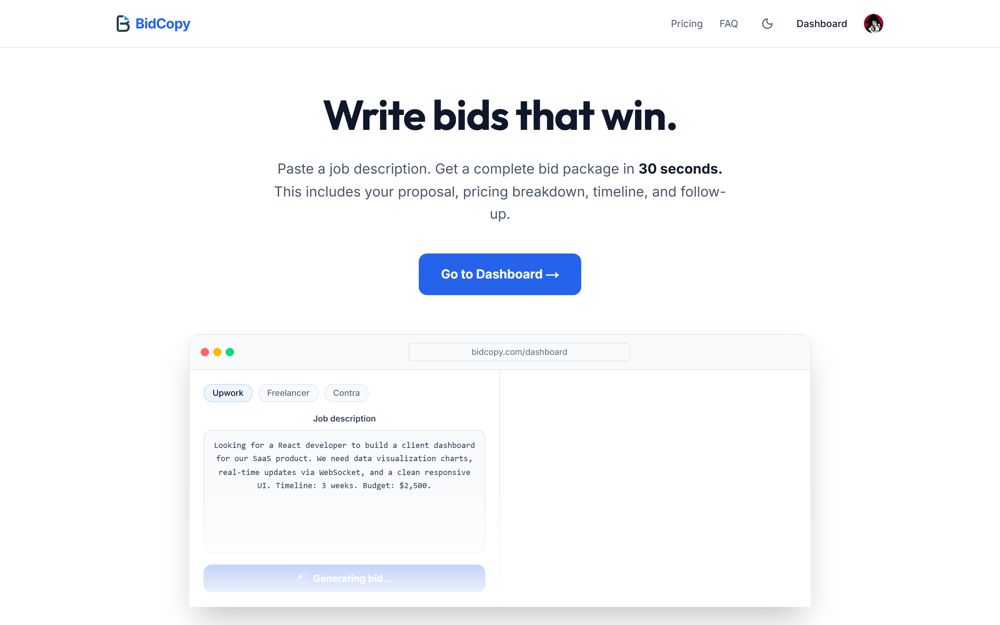
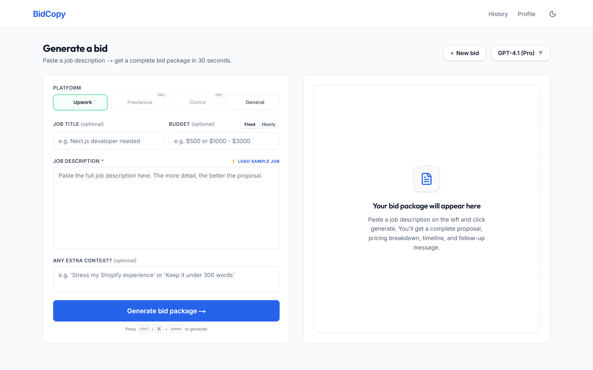
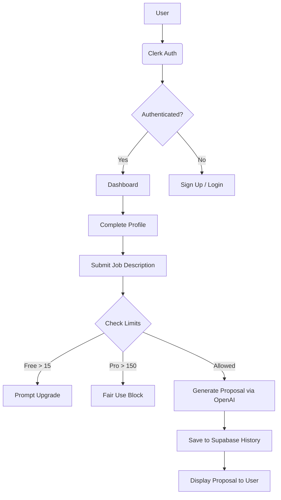

# BidCopy

**AI-Powered Proposal Generator for Freelancers**

BidCopy is a SaaS application designed to help freelancers instantly generate highly customized, persuasive, and professional proposals for job boards like Upwork, Freelancer, and direct client emails. 





---

## 🚀 Features

- **Dynamic Context Engines:** Analyzes job descriptions to generate 300-500 word highly targeted proposals.
- **Tone Adjustment:** Switch between Professional, Friendly, Technical, or Bold tones based on the client.
- **Platform-Specific Formatting:** Optimized output for Upwork (plain text with clear headings) vs. General formats (Markdown, bullet points).
- **Automated Pricing Tables:** Breaks down requested modules into realistic hourly quotes or fixed prices.
- **Freelancer Profiles:** Integrates your existing portfolio and past project highlights seamlessly into proposals.
- **Fair Use Tiering:** Free plan includes 15 daily generations. Pro plan unlocks advanced GPT-4.1 generation with high daily rate limits.

---

## 🛠️ Tech Stack

BidCopy is built using modern web development best practices and robust cloud infrastructure:

- **Framework:** [Next.js (App Router)](https://nextjs.org/)
- **Styling:** [Tailwind CSS](https://tailwindcss.com/)
- **Authentication:** [Clerk](https://clerk.com/)
- **Database & Backend:** [Supabase](https://supabase.com/) (PostgreSQL)
- **AI / LLM:** [OpenAI API](https://openai.com/)
- **Payments:** [Razorpay](https://razorpay.com/)

---

## 🏗️ Architecture Flow



---

## 💻 Getting Started

### Prerequisites

Ensure you have the following installed on your machine:
- Node.js (v18+)
- npm / yarn / pnpm

### Local Development

1. **Clone the repository:**
   ```bash
   git clone https://github.com/your-username/BidCopy.git
   cd BidCopy
   ```

2. **Install dependencies:**
   ```bash
   npm install
   # or
   yarn install
   # or
   pnpm install
   ```

3. **Set up Environment Variables:**
   Create a `.env.local` file in the root directory and add the following keys:
   ```env
   # Clerk Auth
   NEXT_PUBLIC_CLERK_PUBLISHABLE_KEY=your_clerk_pub_key
   CLERK_SECRET_KEY=your_clerk_secret_key

   # Supabase
   NEXT_PUBLIC_SUPABASE_URL=your_supabase_url
   NEXT_PUBLIC_SUPABASE_ANON_KEY=your_supabase_anon_key
   SUPABASE_SERVICE_KEY=your_supabase_service_role_key

   # OpenAI
   OPENAI_API_KEY=your_openai_api_key

   # Razorpay
   RAZORPAY_KEY_ID=your_razorpay_key
   RAZORPAY_KEY_SECRET=your_razorpay_secret
   ```

4. **Run the Development Server:**
   ```bash
   npm run dev
   ```

5. **Open your browser:**
   Navigate to [http://localhost:3000](http://localhost:3000) to see the application.

---

## 🔒 Security & Limits

To ensure optimal performance and prevent API abuse:
- **Free Tier:** 15 generations per day.
- **Pro Tier:** Unlimited experience, subject to a fair-use policy cap of 150 generations per day to protect OpenAI quotas.

---

## 🤝 Contributing

Contributions, issues, and feature requests are welcome! 
Feel free to check the [issues page](https://github.com/your-username/BidCopy/issues) if you want to contribute.

---

## 📄 License

This project is licensed under the MIT License - see the [LICENSE](LICENSE) file for details.
